## <u>1. streaming-day2-1-1장퀴즈리뷰</u>

### 2. Udemy 데이터 시스템 발전 여정 살펴보기

Contents

1. 1장 퀴즈 리뷰
2. Udemy 데이터팀 빌딩 여정
3. Udemy 추천엔진 발전 요약
4. Udemy 추천엔진 1기
5. Udemy 데이터 인프라 클라우드 이전
6. Udemy 추천엔진 2기
7. 사용자가 유데미를 방문하면 무슨 일이 벌어질까?
8. Udemy 이벤트 처리 시스템 2기

 
 
 

## <u>2. streaming-day2-2-Udemy 데이터팀 빌딩 여정</u>

### Udemy 데이터팀 빌딩 여정

2014년 8월 데이터 엔지니어링팀 처음 빌딩 (1)

- 데이터 웨어하우스 도입 (Redshift)
- ETL 프로세스 개발
  - 처음에는 crontab으로 관리하다가 Pinterest의 Pinball로 이전
    - 파이썬을 기본 개발 언어로 사용
    - 지금은 Airflow 사용
  - 처음에는 데이터 복사만 하다가 점차 중요 프로세스 개발도 시작
    - B2B 강사 보수 계산 (소비율에 따라 나눠줌)
    - 중요 파이프라인의 경우 SLA (Service Level Agreement) 설정하고 지표로 계산

 

2014년 8월 데이터 엔지니어링팀 처음 빌딩 (2)

- 주로 개인 네트워크를 활용하여 구인
- 데이터 소스 추가 요청을 받는 슬랙 채널 개설
- 백엔드/프런트엔드 엔지니어링팀과 다양한 협업 시작
  - Incremental Update를 하기위해 프로덕션 DB 테이블 스키마 변경
    - updated_at과 deleted 필드 추가
  - 사용자 이벤트 로그를 프로덕션 DB에서 nginx 로그로 빼는 작업 수행
    - 처음에는 이를 파이썬 스크립트로 처리
    - 나중에 이를 Hadoop 클러스터를 만들고 HDFS로 복사한 다음에 Hive로 처리
    - 궁극적으로는 Kafka에 적재하고 다수의 consumer로 처리 (Connect 사용)
    - 사용자 이벤트를 처리하는 마이크로서비스를구현하고 K8s 위에서 실행함

 

2015년 4월 데이터 분석팀 설립 (1)

Decision Science 팀

- BI 툴 도입 (ChartIO => Tableau)

 

2015년 4월 데이터 분석팀 설립 (2)

B2C 마케팅 기여도 분석 프로세스 정립

- B2B 세일즈 파이프라인 분석 프로세스 정립
- 현업 팀들과 협업 가속화

 

2015년 4월 데이터 사이언스 팀 설립

- Product Science 팀
- ML 모델을 프로덕션에 사용하기 시작
- A/B 프로세스 도입
- ML 모델 배포 프로세스 도입

 
 
 

## <u>3. streaming-day2-3-Udemy 추천엔진 발전 요약</u>

### Udemy 추천엔진 발전 요약

Udemy 추천 화면

유데미 추천 엔진의 구조

- 홈페이지 (개인화된 추천 피드)

사용자별로 어떤 강좌가 노출되었고 무엇이 클릭되었는지가 다 기록되어야함
(다른 엔지니어링팀과 협업이 필수!)

- 긍정 피드백
- 부정 피드백

유닛 #1 - Because you viewed

1. **유닛 랭킹!**
2. **각 유닛내에서의 코스 랭킹**
   - **중복 제거를 어떻게 할까?**

유닛 #2 - Because you wishlisted

 

1기 추천 엔진 (1)

- 배치로 매일 밤에 지난 90일간 방문했던 사용자들과 어느 조건이 \
  충족되는 강의들의 모든 페어에 대해 각종 확률을 예측 (3개의 모델)

      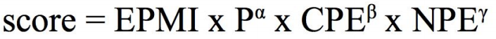

- 이 데이터 처리와 모델 예측 계산은 하둡과 하이브(Hive)를 사용해 수행
- 이 정보를 캐싱시스템에 저장하고 이를 유닛 랭킹과 유닛내의 강의 소팅에 사용

추천엔진 성공 지표와 객관적인 측정 방법 마련

- A/B 테스트 프레임웍!
- 먼저 A/B 테스트 프레임웍으로 다른 테스트 수행하여 신뢰를 높임

 

잠깐! Regression toward the Mean

- 평균으로 회귀: 처음에는 들쭉날쭉해도 결국은 원래 성과가 나온다는 말
  - 극단적이거나 비정상적인 관측값 뒤에 더 일반적인 또는 평균적인 관측값이 \
    뒤따를 가능성이 높다는 것을 시사하는 통계적 현상: 레스토랑 리뷰
- 초기 Review rating이 좋은 강의를 더 많은 사람들에게 노출시킨다면?
  - 보통 이 경우 rating은 낮아질 확률이 높음
  - NBA 등의 프로스포츠에서 이야기하는 소포모어 징크스라 부름
- 강의처럼 개인별 관심 여부가 많이 달라지는 영역에서는 더 심함
  - 더 많이 노출될수록 덜 관심있는 사람들에게 노출될 가능성이 높아지면서 평점이 내려감

 

2기 추천 엔진 (1)

추천 계산을 실시간으로 바꿈

- 배치 추천에 비해 많은 장점이 존재
  - 유데미를 사용하는 모든 사용자에게 추천 제공
  - 사용자가 로그인하거나 홈페이지를 방문하는 순간 추천 시작
  - 불필요한 데이터 인프라 비용 절감
- 시스템의 복잡도가 올라감
  - Kafka와 Cassandra와 같은 메세지큐와 NoSQL을 사용하기 시작
  - 새로운 서비스들의 모니터링이 필요
- 각종 모델 예측 기능을 API로 노출

 

2기 추천 엔진

- 일부 피쳐는 배치로 여전히 매일매일 계산
  - 하둡과 Spark을 사용 (모델 빌딩과 서빙과 협업 필터링)
  - 이런 피쳐들은 Cassandra라는 NoSQL에 저장됨
- 추천/검색 관련 BE/FE 엔지니어들을 데이터팀 밑으로 이동
  - 이 엔지니어들이 속한 팀을 Discovery Engineering 팀이라고 부름
  - 이 팀이 나중에 사용자 이벤트 수집을 하는 마이크로서비스도 만듬

 
 
 

## <u>4. streaming-day2-4-Udemy 추천엔진 1기</u>

### Udemy 추천엔진 1기

2015년 5월 ML 추천 모델 개발 시작 (1)

- Hadoop 클러스터 도입

  - 클라우드가 아닌 On-prem에 직접 설치
  - 배치 처리에 초점을 맞춤
  - Hive와 Python 기반 UDF로 사용자 이벤트 데이터 처리

    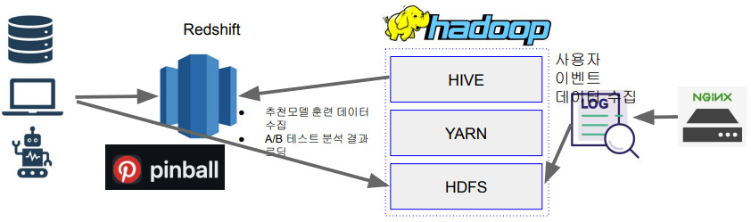

 

잠깐! Nginx란?

- 보통 웹서버 들의 앞단에 로드밸런서(Load Balancer)로 사용
  - 특정 서버 라우팅
- 동시에 요청을 로그하는데 사용 (HTTP 요청헤더와 응답헤더 내용을 기록)
  - 보통 이 로그를 logstash등의 툴을 사용해서 HDFS나 Kafka로 푸시
    - logstash (Data Producer 역할)

 

2015년 5월 ML 추천 모델 개발 시작 (2)

먼저 A/B 프로세스 도입
동시에 모델 배포 프로세스에 대한 협의 시작

2015년 5월 ML 추천 모델 개발 시작 (3)

모델 배포 프로세싱 과정

- R로 만든 모델 빌딩: 훈련 데이터는 Hive로 정제해서 만듬
- 이를 PMML이란 포맷으로 덤프
- PMML을 자바로 만든 추천 마이크로서비스에서 API 형태로 서빙
  - 이를 백엔드 엔지니어링팀이 호출하고 모든 정보를 기록 (Impressions, Clicks, …)
  - PMML을 자바에서 로딩해주는 오픈소스를 사용
- 2017년 여름에 실시간으로 추천 강의를 계산하는 걸로 고도화

 

잠깐! A/B 테스트란? (1)

- 온라인 서비스에서 새 기능의 임팩트를 객관적으로 측정하는 방법
  - 의료쪽에서 무작위 대조 시험(Randomized Controlled Trial)
- 새로운 기능을 론치함으로 생기는 위험부담을 줄이는 방법
  - 100%의 사용자에게 론치하는 것이 아니라 작게 시작하고 관찰 후 결정
  - 실제 예제: 추천을 기계학습기반으로 바꾼 경우
    - 먼저 5%의 사용자에게 론치 후 나머지 95%의 사용자와 매출액 등 중요 지표 기반 비교
    - 5%, 10%, 20% 이런 식으로 점진적으로 높이고 최종적으로 100%로 론치

 

잠깐! 마찰이 생기는 지점 - 개발된 모델의 이양 관련

- 많은 수의 데이터 과학자들은 R을 비롯한 다양한 툴로 모델 개발
- 하지만 실제 프로덕션 환경은 다양한 모델들을 지원하지 못함
  - 개발/검증된 모델의 프로덕션 환경 론치시 시간이 걸리고 오류 가능성이 존재
  - 심한 경우 모델 관련 개발을 다시 해야함 (피쳐 계산과 모델 실행 관련)

 

잠깐! Data Drift로 인한 모델 성능 저하

- ML 모델에서 가장 중요한 것은 훈련 데이터
- 시간이 지나면서 훈련에 사용한 데이터와 실제 환경의 데이터가 다르게 변화함
  - 이를 Data drift라고 부르며 이를 모니터링하는 것이 중요
- 즉 주기적으로 ML 모델을 다시 빌딩해주는 일이 필요

 
 
 

## <u>5. streaming-day2-5-Udemy 데이터 인프라 클라우드 이전</u>

### Udemy 데이터 인프라 클라우드 이전

- CTO 설득에 시간이 오래 걸림
- 직접 데이터 센터를 운영하는 경우 서버 증설에 보통 2-3달이 걸림
- On-Prem과 클라우드의 하이브리드 모델에서 클라우드로 이전
  - 기존 On-Prem 서버들은 개발용으로 전환
  - 서버 용량 확장에 걸리는 시간 대폭 감소: 주문 => 배달 => 조립 => 설치 과정 불필요
- S3등을 사용하면서 데이터 시스템 발전에 큰 도움이 됨

 

2016년 데이터 레이크와 Spark 도입 (1)

- Hive 중심의 YARN/Hadoop 환경에서 Hive+Spark 중심으로 변화

  - Spark 트레이닝 과정을 모든 데이터 엔지니어들과 원하는 데이터 과학자들에게 제공
  - S3를 데이터 레이크와 HDFS를 사용
  - Hive meta-store 중심으로 테이블들을 저장

- 여전히 Redshift를 정제된 구조화 데이터 분석을 위한 DW로 사용
- Data Engineer들을 중심으로 Spark 교육 시작
  - 처음에는 Scala로 개발하다가 나중에 PySpark으로 넘어감
  - Notebook 환경으로 데이터 과학자들도 Spark ML을 직접 사용하기 시작
    - 주피터 노트북과 제플린 노트북

 
 
 

## <u>6. streaming-day2-6-Udemy 추천엔진 2기</u>

### Udemy 추천엔진 2기

2016년 Kafka 도입

- 점점더 실시간 데이터 처리에 대한 요구 증대: Kafka 도입

  - 모든 사용자 이벤트 데이터는 모두 먼저 Kafka에 저장

    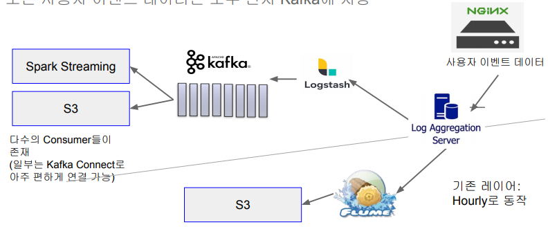

 

2016년 Spark ML과 Spark Streaming 사용

- Spark이 도입되면서 ML 모델링과 스트림 데이터 처리도 시작
  - Scikit-learn과 R 기반 모델링에서 Spark ML 기반으로 변경
- Spark-Streaming을 사용해서 추천 모델을 실시간으로 변경 (2017년 여름)
  - Kafka를 사용했고 운영상의 이슈로 처음에는 쉽지 않았음 (문화의 중요성 절감)
  - 일부 feature들은 배치로 계산해서 Cassandra에 저장
    - Pre-computed features라 부르고 이는 Spark SQL과 UDF를 사용
  - 일부 feature들은 실시간으로 계산해서 사용
    - 이는 Spark Streaming과 Kafka 사용

 

실시간 추천 엔진 아키텍처 (1)

~~- 미리 지난 90일간 로그인한 사용자를 대상으로 계산~~

- 사용자가 나타나는 순간 실시간으로 추천 계산

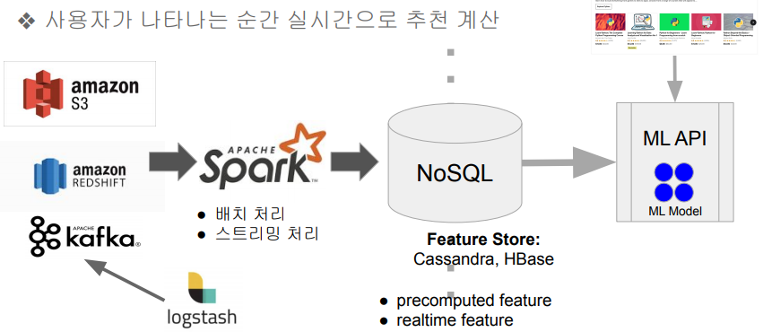

실시간 추천 엔진 아키텍처 (2)

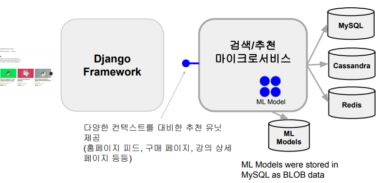

 
 
 

## <u>7. streaming-day2-7-사용자가 유데미를 방문하면 무슨 일이 벌어질까</u>

### 사용자가 유데미를 방문하면 무슨 일이 벌어질까?

When a user accesses Udemy Site

- Django 프레임웍은 추천 마이크로서비스의 홈 피드 API를 호출하고 \
  새로운 방문자가 생겼음을 카프카의 특정 토픽으로 기록 (Kafka Producer 역할)

 

Input and output to the Microservice

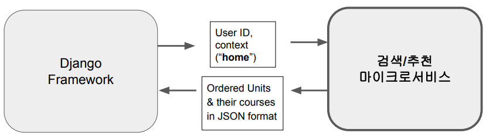

 

Inside the Microservice

- 마이크로서비스는 먼저 사용자의 행동 및 기타 요인을 기반으로  
  생성할 유닛 수를 파악
- 일단 있는 정보를 바탕으로 추천 유닛과 강의 생성
- 해당 정보를 JSON 형태로 리턴
- 백그라운드에서 Spark Streaming Consumer가 해당 사용자에 대한 추천 \
  강의 내용 업데이트 시작

  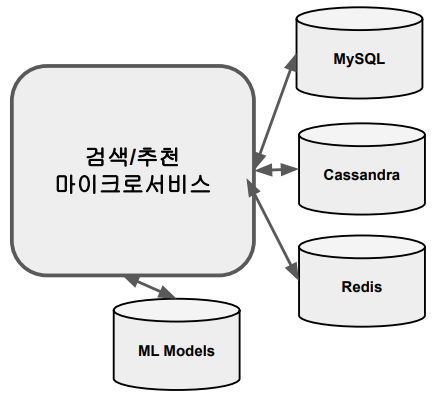

 

Javascripts in the page starts sending logs to Nginx

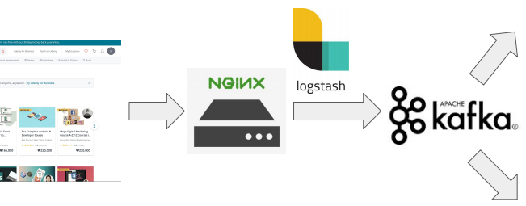

- 강의 노출 (impression) 로그가 Nginx로 보내짐 (hidden pixel)
  - 이 정보는 추천시 필요한 negative feedback을 위해서 필요
- Log aggregate server에 설치된 logstash가 이를 Kafka Topic으로 로딩
- 또한 Log aggregate server에 있는 Flume이 해당 정보를 S3로 매시간 저장
  - 사실 이 부분은 Kakfa Connect 등을 이용해서 대체 가능 (나중에 대체)

 

If you click a course in the units, then ...

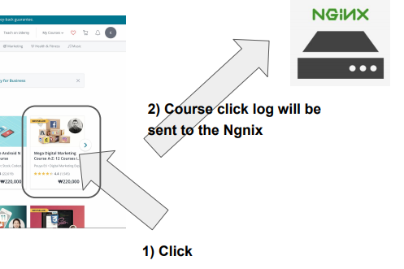

 

Now You Land in a Course Detail Page

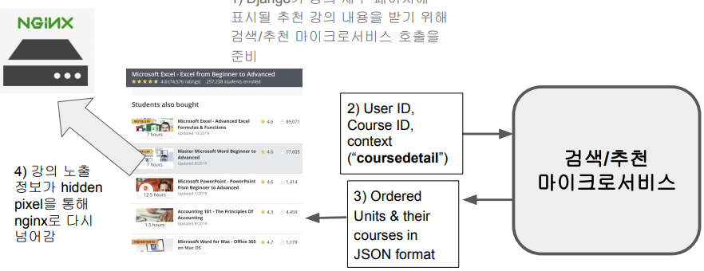

1. Django가 강의 세부 페이지에 표시될 추천 강의 내용을 받기 위해 \
   검색/추천 마이크로서비스 호출을 준비
2. User ID, Course ID, context(“coursedetail”)
3. Ordered Units & their courses in JSON format
4. 강의 노출 정보가 hidden pixel을 통해 nginx로 다시 넘어감

 
 
 

## <u>8. streaming-day2-8-Udemy 이벤트 처리 시스템 2기</u>

### Udemy 이벤트 처리 시스템 2기

이벤트 처리 시스템 1기 시스템 구조 (2)

- 실시간처리와 배치처리를 위한 두 개의 시스템 존재
  - 배치 처리는 syslog와 Flume을 사용 (nginx -> syslog -> Flume -> S3)
  - 실시간 처리는 Kafka를 사용 (nginx -> syslog -> logstash -> Kafka)

 

이벤트 처리 시스템 1기 시스템 구조 (배치 처리)

- 배치 처리 구조를 조금더 자세히 살펴보자

  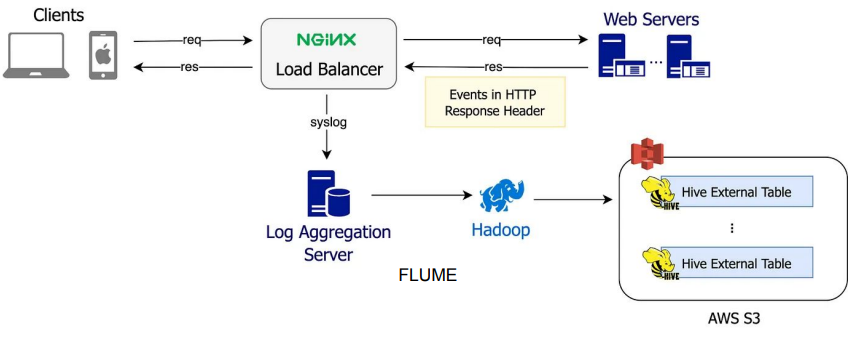

 

Nginx 기반 시스템 1기의 문제점

- 낮은 확장성
  - 기존 로그 집계 서버는 확장이 쉽지 않은 복잡한 구조. \
    Nginx, Syslog, Logstash, Flume을 사용해서 Kafka와 S3로 별도로 적재
  - 이벤트 로깅이 암묵적으로 이뤄지다보니 개발자들이 실수로 삭제하거나 내용을 모르고 수정하는 일이 빈번
- 낮은 데이터 품질:
  - 기존 시스템에는 실시간 이벤트 유효성 검사 메커니즘 부재. 스키마 검증 필요!
    - 다운스트림 소비자에게 장애가 발생해야만 이슈 인지
- 문서화 부족

 

Nginx 기반 시스템 1기 문제점 해결책

- Kafka를 더 많이 활용
- 이벤트 수집기를 별도 구현
  - 프런트 엔드, 백엔드(Python, Kotlin), iOS, Android
  - 이벤트 수집기를 K8s위에서 실행 (Auto-Scaling)
    - AWS EKS(Elastic Kubernetes Service)를 사용

 

참고! Avro란?

- Avro는 Row-based 데이터 포맷으로 Binary 포맷
- 2009년 Hadoop Open Source 프로젝트의 하부 프로젝트로 시작
- Parquet와 비교
  - Parquet는 Column-based. Avro는 Row-based
  - Parquet는 Spark이나 DW등에서 데이터 분석용으로 배치 쿼리 수행시 더 적합한 포맷
  - Avro는 데이터 송수신이나 스키마 변경 감지등에 더 최적화된 포맷
    - 실시간 처리 데이터 포맷으로 최적

 

이벤트 처리 시스템 2기 시스템 구조

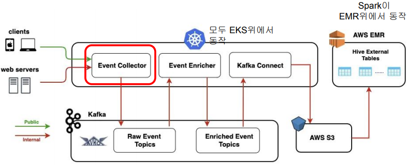

 
 
 
 
 
 

- **Keyword**:

 
 
 
 
 
 
