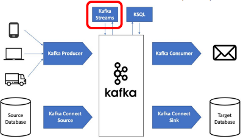

## <u>1. streaming-day3-1-Kafka 역사와 소개</u>

### 3. Kafka 소개

Contents

1. Kafka 역사
2. Kafka 소개
3. Kafka 아키텍처
4. Kafka 중요 개념
5. Kafka 설치
6. Kafka Python 프로그래밍

<br>

### Kafka 역사

Kafka의 탄생

- 2008년 LinkedIn에서 내부 실시간 데이터 처리를 위해 개발한 소프트웨어 플랫폼
  - Scala와 Java로 작성
- 2011년 초에 오픈소스화 (Apache)
  - https://kafka.apache.org/
- 현재 포춘지 선정 100대 기업 중 80% 이상이 Kafka를 사용

<br>

### Kafka 소개

Kafka란 무엇인가?

- 실시간 데이터를 처리하기 위해 설계된 오픈소스 분산 스트리밍 플랫폼
  - 데이터 재생이 가능한 분산 커밋 로그 (Distributed Commit Log)
- Scalability와 Fault Tolerance를 제공하는 Publish-Subscription 메시징 시스템
  - Producer-Consumer
- High Throughput과 Low Latency 실시간 데이터 처리에 맞게 구현됨
- 분산 아키텍처를 따르기 때문에 Scale Out이란 형태로 스케일 가능
  - 서버 추가를 통해 Scalability 달성 (서버 = Broker)
- 정해진 보유기한 (retention period) 동안 메시지를 저장

<br>

기존 메시징 시스템 및 데이터베이스와의 비교

- 기존 메시징 시스템과 달리, 카프카는 메시지를 보유 기간 동안 저장
  - 소비자가 오프라인 상태일 때에도 내구성과 내결함성을 보장
  - 기본 보유 기간은 일주일
- Kafka는 메시지 생산과 소비를 분리
  - 생산자와 소비자가 각자의 속도에 맞춰 독립적으로 작업이 가능하도록 함
  - 시스템 안정성을 높일 수 있음
- Kafka는 높은 처리량과 저지연 데이터 스트리밍을 제공
  - Scale-Out 아키텍처
- 한 파티션 내에서는 메세지 순서를 보장해줌
  - 다수의 파티션에 걸쳐서는 “Eventually Consistent”
  - 토픽을 생성할 때 지정 가능 (Eventual Consistency vs. Strong Consistency)
- 사내 내부 데이터 버스로 사용되기 시작
  - 워낙 데이터 처리량이 크고 다수 소비자를 지원하기에 가능

<br>

잠깐! Eventual Consistency란? (1)

- 100대 서버로 구성된 분산 시스템에 레코드를 하나 쓴다면 그 레코드를 바로 읽을 수 있을까?
  - 내가 쓴 레코드가 리턴이 될까?
  - 보통 하나의 데이터 블록은 여러 서버에 나눠 저장됨 (Replication Factor)
    - 그래서 데이터를 새로 쓰거나 수정하면 이게 전파되는데 시간이 걸림
  - 보통 읽기는 다수의 데이터 카피 중에 하나를 대상으로 일어나기 때문에 앞서 전파 시간에 \
    따라 데이터가 있을 수도 있고 없을 수도 있음
- Strong Consistency vs. Eventual Consistency
  - 보통 데이터를 쓸때 복제가 완료될 때까지 기다리는 구조라면 Strong Consistency
  - 그게 아니라 바로 리턴한다면 Eventual Consistency

<br>

잠깐! Eventual Consistency란? (2)


<br>

Kafka의 주요 기능 및 이점

- 스트림 처리
  - Kafka는 실시간 스트림 처리를 목표로 만들어진 서비스
  - ksqlDB를 통해 SQL로도 실시간 이벤트 데이터 처리 가능
- High Throughput (높은 처리량)
  - Kafka는 초당 수백만 개의 메시지 처리 가능
- Fault Tolerance (내결함성)
  - Kafka는 데이터 복제 및 분산 커밋 로그 기능을 제공하여 장애 대응이 용이
- Scalability (확장성)
  - Kafka의 분산 아키텍처는 클러스터에 브로커를 추가하여 쉽게 수평 확장 가능
- 풍부한 생태계의 존재
  - Kafka는 커넥터와 통합 도구로 구성된 풍부한 에코시스템을 갖추고 \
    있어 다른 데이터 시스템 및 프레임워크와 쉽게 연동 가능
  - Kafka Connect, Kafka Schema Registry

<br>
<br>
<br>

## <u>2. streaming-day3-2-Kafka-아키텍처</u>

### Kafka 아키텍처

데이터 이벤트 스트림

- 데이터 이벤트 스트림을 **Topic**이라고 부름

  - Producer는 Topic을 만들고 Consumer는 Topic에서 데이터를 읽어들이는 구조
  - 다수의 Consumer가 같은 Topic을 기반으로 읽어들이는 것이 가능

    

<br>

Message (Event) 구조: Key, Value, Timestamp

- 최대 1MB
- Timestamp는 보통 데이터가 Topic에 추가된 시점
- Key 자체도 복잡한 구조를 가질 수 있음
  - Key가 나중에 Topic 데이터를 나눠서 저장할 때 사용됨 (Partitioning)
- Header는 선택적 구성요소로 경량 메타 데이터 정보 (key-value pairs)

  

<br>

- key hashing partitioning 방법
  - data skew 주의

<br>

Kafka 아키텍처 - Topic과 Partition

- 하나의 Topic은 확장성을 위해 다수의 Partition으로 나뉘어 저장됨
- 메세지가 어느 Partition에 속하는지 결정하는 방식에 키의 유무에 따라 달라짐

  - 키가 있다면 Hashing 값을 Partition의 수로 나눈 나머지로 결정
  - 키가 없다면 라운드 로빈으로 결정 (비추)

    

<br>

Kafka 아키텍처 - Topic과 Partition과 복제본

- 하나의 Partition은 Fail-over를 위해 Replication Partition을 가짐
- 각 Partition별로 Leader와 Follower가 존재

  - 쓰기는 Leader를 통해 이뤄지고 읽기는 Leader/Follower들을 통해 이뤄짐
  - Partition별로 Consistency Level을 설정 가능 (in-sync replica - “ack”)

    

<br>

- Partition별로 누가 Leader이고 Follower인지 관리가 중요

<br>

Kafka 아키텍처 - [Topic 파라미터들](https://kafka.apache.org/documentation/#topicconfigs)

- 이름: “MyTopic”
- Partition의 수: 3
- 복제본의 수: 3
- Consistency Level (“acks”): “all”
- 데이터 보존 기한: 기본 일주일
- 메세지 압축 방식
- …

- Strong Consistency vs. Eventual Consistency

<br>

Kafka 아키텍처 - Broker: 실제 데이터를 저장하는 서버

- Kafka 클러스터는 기본적으로 다수의 Broker로 구성됨
  - 여기에 원활한 관리와 부가 기능을 위한 다른 서비스들이 추가됨 (Zookeeper가 대표적)
  - 한 클러스터는 최대 20만개까지 partition을 관리 가능
  - Broker들이 실제로 Producer/Consumer들과 통신 수행
- 앞서 이야기한 **Topic의 Partition들을 실제로 관리해주는 것이 Broker**
  - 한 Broker는 최대 4000개의 partition을 처리 가능
- Broker는 물리서버 혹은 VM 위에서 동작
  - 해당 서버의 디스크에 Partition 데이터들을 기록함
- Broker의 수를 늘림으로써 클러스터 용량을 늘림 (Scale Out)

- 앞서 20만개, 4천개 제약은 **Zookeeper**를 사용하는 경우임
  - 이 문제 해결을 위해서 Zookeeper를 대체하는 모드도 존재 (KRaft)

<br>

Kafka 아키텍처 - 메타 정보 관리를 어떻게 할 것인가?

- Broker 리스트 관리 (Broker Membership)
  - 누가 Controller인가? (Controller Election)
- Topic 리스트 관리 (Topic Configuration)
  - Topic을 구성하는 Partition 관리
  - Partition별 Replica 관리
- Topic별 ACL (Access Control Lists) 관리
- Quota 관리

<br>

Kafka 아키텍처: [Zookeeper와 Controller](https://developer.confluent.io/learn-kafka/architecture/control-plane/)

- Kafka 0.8.2 (2015년)부터 Controller가 도입됨
  - Controller는 Broker이면서 Partition 관리
- 장기적으로 Zookeeper의 사용을 최소화하거나 사용 자체를 없애려는 것이 목표
- [현재로는 두 가지 모드가 존재](https://www.baeldung.com/kafka-shift-from-zookeeper-to-kraft)
  - Zookeeper 모드
    - 3, 5, 7대의 서버를 Zookeeper Ensemble을 구성하기 위해 사용
    - Controller가 Zookeeper를 통해 메타데이터 관리와 리더 선출 담당
    - 하나의 Controller가 존재
  - [KRaft 모드](https://developer.confluent.io/learn/kraft/)
    - Zookeeper를 완전히 배제 Controller가 역할을 대신 수행
    - 다수의 Controller들이 Zookeeper 역할을 대신 수행
      - Controller들은 보통 Broker들이기도 함

<br>

잠깐! Zookeeper (1)

- 분산 시스템에서 널리 사용되는 Distributed Coordination Service

  - 동기화, 구성 관리, 리더 선출 등 분산 시스템의 관리하고 조율을 위한 중앙 집중 서비스 제공

- 원래 Yahoo! Hadoop 프로젝트의 일부로 자바로 개발됨

  - 이후 Apache 오픈소스 소프트웨어로 변신

- 하지만 다양한 문제 존재
  - 지원하는 데이터 크기가 작고 동기모드로 동작하기에 처리 속도가 느림
    - 즉 어느 스케일 이상으로 확장성이 떨어짐
  - 환경설정도 복잡함
  - 그러다보니 Zookeeper를 사용하던 서비스들이 Zookeeper를 대체하기 시작
    - ElasticSearch가 또다른 예

<br>

잠깐! Zookeeper (2)

- ZooKeeper의 일반적인 사용 사례
  - 메시지 큐를 위한 Apache Kafka
  - 분산 데이터베이스 조정을 위한 Apache HBase
  - 분산 스트림 처리를 위한 Apache Storm
  - …

<br>
<br>
<br>

## <u>3. streaming-day3-3-Kafka-중요개념</u>

### Kafka 중요 개념

Producer, Broker, Consumer, Controller, Consumer Group


<br>

Topics, Partitions, Segments


- Partition은 Segment로 구성됨

<br>

Topic

- Consumer가 데이터(Message)를 읽는다고 없어지지 않음
- Consumer별로 어느 위치의 데이터를 읽고 있는지 위치 정보를 유지함
- Fault Tolerance를 위해 이 정보는 중복 저장됨

  

<br>

Partition과 Segment

- 하나의 Partition은 다수의 Segment로 구성됨
  - Segment는 변경되지 않는 추가만 되는 로그 파일이라고 볼 수 있음 (Immutable, Append-Only)
    - Commit Log
- 각 Segment는 디스크상에 존재하는 하나의 파일
- Segment는 최대 크기가 있어서 이를 넘어가면 새로 Segment 파일을 만들어냄

  - 그래서 각 Segment는 데이터 오프셋 범위를 갖게 됨
  - Segment의 최대 크기는 1GB 혹은 일주일치의 데이터

    

<br>

로그 파일의 특성 (Partition의 특성 => 정확히는 Segment의 특성)

- 항상 뒤에 데이터(Message)가 쓰여짐: Append Only
- 한번 쓰여진 데이터는 불변 (immutable)
- Retention period에 따라 데이터를 제거하기도 함
- 데이터에는 번호(offset)가 주어짐

<br>

참고! Commit Log란?

- Sequential, Immutable, Append-Only
- WAL (Write Ahead Logging)
  - 데이터 무결성과 신뢰성을 보장하는 표준 방식
  - 데이터베이스에 대한 모든 변경 사항을 먼저 Commit Log라는 추가 전용 파일에 기록
- Replication과 Fault Tolerance의 최소 단위
- Data Recovery나 Replay에 사용 가능

<br>

Broker의 역할 (1)

- Topic은 다수의 시간순으로 정렬된 Message들로 구성
- Producer는 Topic을 먼저 생성하고 속성 지정
- Producer가 Message들을 Broker로 전송
- Broker는 이를 Partition으로 나눠 저장 (중복 저장)
  - Replication Factor: Leader & Follower
- Consumer는 Broker를 통해 메세지를 읽음

<br>

broker의 역할 (2)

- 하나의 Kafka 클러스터는 다수의 Broker로 구성됨
- 하나의 Broker는 다수의 Partition들을 관리/운영
- 한 Topic에 속한 Message들은 스케일을 위해 다수의 Partition들에 분산 저장
- 다수의 Partition들을 관리하는 역할을 하는 것이 Broker들
  - 한 Broker가 보통 여러 개의 Partition들을 관리하며 이는 Broker가 있는 서버의 디스크에 저장됨
  - Broker들 전체적으로 저장된 Partition/Replica의 관리는 Controller의 역할
- 하나의 Partition은 하나의 로그 파일이라고 볼 수 있음
  - 각 Message들은 각기 위치 정보(offset)를 갖고 있음
- 이런 Message들의 저장 기한은 Retention Policy로 지정

<br>

Producer의 Partition 관리방법

- 하나의 Topic은 다수의 Partition으로 구성되며 이는 Producer가 결정
- Partition은 두 가지 용도로 사용됨
  - Load Balancing
  - Semantic Partitioning (특정 키를 가지고 레코드를 나누는 경우)
- Producer가 사용 가능한 Partition 선택 방법
  - 기본 Partition 선택: hash(key) % Partition의 수
  - 라운드 로빈: 돌아가면서 하나씩 사용
  - 커스텀 Partition 로직을 구현할 수도 있음

<br>

Consumer 기본

- Topic을 기반으로 Message를 읽어들임 (Subscription이란 개념 존재)
- Offset를 가지고 마지막 읽어들인 Message 위치정보 유지
- Command Line Consumer 유틸리티 존재
- Consumer Group라는 개념으로 Scaling 구현
  - Backpressure 문제 해결을 위한 방법
- Consumer는 다시 Kafka에 새로운 토픽을 만들기도 함
  - 아주 흔히 사용되는 방법으로 하나의 프로세스가 Consumer이자 Producer 역할 수행

<br>
<br>
<br>

## <u>4. streaming-day3-4-Kafka-기타 기능 살펴보기</u>

### Kafka 기타 기능 살펴보기

Kafka Connect란? (1)

- Kafka Connect는 Kafka 위에 만들어진 중앙집중 데이터 허브
  - 별도의 서버들이 필요하며 Kafka Connect는 별도의 오픈소스 프로젝트임
  - 데이터 버스 혹은 메세지 버스라고 볼 수 있음
- 두 가지 모드가 존재
  - Standalone 모드: 개발과 테스트
  - Distributed 모드
- 데이터 시스템들 간의 데이터를 주고 받는 용도로 Kafka를 사용하는 것
  - 데이터 시스템의 예: 데이터베이스, 파일 시스템, 키-값 저장소, 검색 인덱스 등등
  - 데이터 소스와 데이터 싱크

<br>

Kafka Connect란? (2)

- Broker들 중 일부나 별개 서버들로 Kafka Connect를 구성
  - 그 안에 Task들을 Worker들이 수행. 여기서 Task들은 Producer/Consumer 역할
    - Source Task, Sink Task
  - 외부 데이터(Data Source)를 이벤트 스트림으로 읽어오는 것이 가능
  - 내부 데이터를 외부(Data Sink)로 내보내어 Kafka를 기존 시스템과 지속적으로 통합 가능
    - 예: S3 버킷으로 쉽게 저장

<br>

Kafka Connect란? (3)


<br>

Kafka Schema Registry (1)

- Schema Registry는 Topic 메시지 데이터에 대한 스키마를 관리 및 검증하는데 사용
- Producer와 Consumer는 Schema Registry를 사용하여 스키마 변경을 처리

  

<br>

참고! Serialization and Deserialization

- Serialization (직렬화)
  - 객체의 상태를 저장하거나 전송할 수 있는 형태로 변환하는 프로세스
  - 보통 이 과정에서 데이터 압축등을 수행. 가능하다면 보내는 데이터의 스키마 정보 추가
- Deserialization (역직렬화)
  - Serialized된 데이터를 다시 사용할 수 있는 형태로 변환하는 Deserialization
  - 이 과정에서 데이터 압축을 해제하거나 스키마 정보 등이 있다면 데이터 포맷 검증도 수행

<br>

Kafka Schema Registry (2)

- Schema ID(와 버전)를 사용해서 다양한 포맷 변천(Schema Evolution)을 지원
  - 보통 AVRO를 데이터 포맷으로 사용 (Protobuf, JSON)
- 포맷 변경을 처리하는 방법

  - Forward Compatibility: Producer부터 변경하고 Consumer를 점진적으로 변경
  - Backward Compatibility: Consumer부터 변경하고 Producer를 점진적으로 변경
  - Full Compatibility: 둘다 변경

    

누가 메세지의 serialization과 deserialization을 담당하는가?

- 보통 Kafka 관련 라이브러리를 해줌

<br>

Kafka 아키텍처 - REST Proxy

- 클라이언트가 API 호출을 사용하여 Kafka를 사용 가능하게 해줌
  - 메시지를 생성 및 소비하고, 토픽을 관리하는 간단하고 표준화된 방법을 제공
  - REST Proxy는 메세지 Serialization과 Deserialization을\
    대신 수행해주고 Load Balancing도 수행
- 특히 사내 네트워크 밖에서 Kafka를 접근해야할 필요성이 있는 경우 더 유용

<br>

Kafka 아키텍처 - Streams와 KSQL

- Kafka Streams: Kafka Topic을 소비하고 생성하는 실시간 스트림 처리 라이브러리
  - Spark Streaming으로 Kafka Topic을 처리하는 경우는 조금더 micro batch에 가까움
  - Kafka Streams로 Kafka Topic을 처리하는 것은 조금더 \
    Realtime에 가까움 (레코드 단위 처리)

~~- KSQL: Confluent에서 개발한 Kafka용 오픈 소스 SQL 엔진~~
~~- SQL을 사용해 스트리밍 데이터를 실시간으로 쿼리, 분석, 처리할 수 있는 방법 제공 (Continuous Query)~~
~~- SQL로 코드 작성의 복잡성을 추상화하여 스트림 처리 애플리케이션 개발을 간소화~~



<br>

Kafka 아키텍처 - ksqlDB

- [Kafka Streams로 구현된 스트림 처리 데이터베이스](https://www.confluent.io/blog/ksql-streaming-sql-for-apache-kafka/)로 KSQL을 대체
  - SQL과 유사한 쿼리 언어. 필터링, 집계, 조인, 윈도우잉 등과 같은 SQL 작업 지원
  - 연속 쿼리: ksqlDB를 사용하면 데이터가 실시간으로 도착할 때  
    지속적으로 처리하는 연속 쿼리 생성 가능
  - 지속 업데이트되는 뷰 지원: 실시간으로 지속적으로 업데이트되는 집계 및 변환 가능
- Spark에서 보는 것과 비슷한 추세: SQL이 대세

<br>
<br>
<br>

## <u>5. streaming-day3-5-Kafka-설치</u>

### Kafka 설치

Kafka 설치 방식

- Docker Compose 사용
  - Docker Desktop을 먼저 실행할 것
- 아래 Github repo 사용
  - https://github.com/conduktor/kafka-stack-docker-compose
    - 다양한 yml 파일들이 존재
      - full-stack.yml
      - zk-single-kafka-single.yml
      - zk-single-kafka-multiple.yml
      - zk-multiple-kafka-single.yml
      - zk-multiple-kafka-multiple.yml

<br>

Kafka 설치 과정 - Docker Compose 사용

- docker compose -f full-stack.yml up
  - 컴퓨터 사양이 좋은 경우 full-stack.yml을 사용
  - 아니면 zk-single-kafka-single.yml이나 zk-single-kafka-multiple.yml을 사용

<br>

Kafka 설치 과정 - Docker Compose yaml 파일 확인
version: '2.1'
services:
zoo1:
kafka1:
kafka-schema-registry:
kafka-rest-proxy:
kafka-connect:
ksqldb-server:
conduktor-platform:
volumes:

<br>

### 데모: docker compose:

<br>
<br>
<br>

## <u>6. streaming-day3-6-Kafka Python 프로그래밍 기본과 숙제</u>

### Kafka Python 프로그래밍

Python:

- Confluent Kafka Python: Confluent에서 개발한 공식 Kafka Python 클라이언트 라이브러리
- Kafka-Python: 또다른 파이썬 기반 라이브러리

<br>

Python 모듈 설치

- pip3 install kafka-python

<br>

간단한 Producer 만들기


<br>

잠깐: Python Lambda 함수

- 람다 함수는 흔히 이야기하는 함수형 언어(LISP, Haskell, …)에서는 기본 개념
  - Imperative Programming (step-by-step): Python, C/C++, Java, …
  - Functional Programming (수학 공식처럼 함수를 연결해서 계산): Erlang, Lisp,
  - Declarative Programming (원하는 결과와 어디서 그걸 얻을지만 기술): SQL
- 파이썬에서 람다함수를 사용하는 경우는?
  - 보통 higher-order 함수 (함수를 인자로 받는 함수)의 인자로 람다함수를 사용
    - higher-order 함수의 예: map, filter, reduce, sorted… 앞의 value_serializer
    - Pandas의 일부 함수들은 higher-order 함수: apply, assign, map, …
  - 람다함수의 포맷:
    - lambda arguments: expression
    - 예) lambda x: dumps(x).encode('utf-8')

<br>

### 숙제

```sh
# 패키지 설치 경로 지정
$ pip install --target=<python 경로> <패키지명>
```

<br>
<br>
<br>
<br>
<br>
<br>

- **Keyword**:

<br>
<br>
<br>
<br>
<br>
<br>
