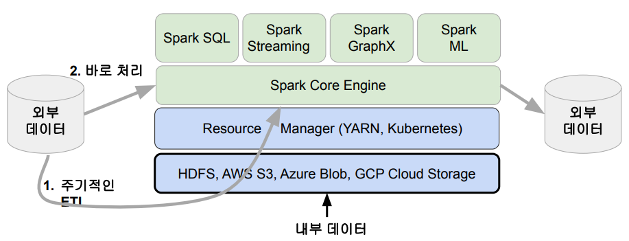
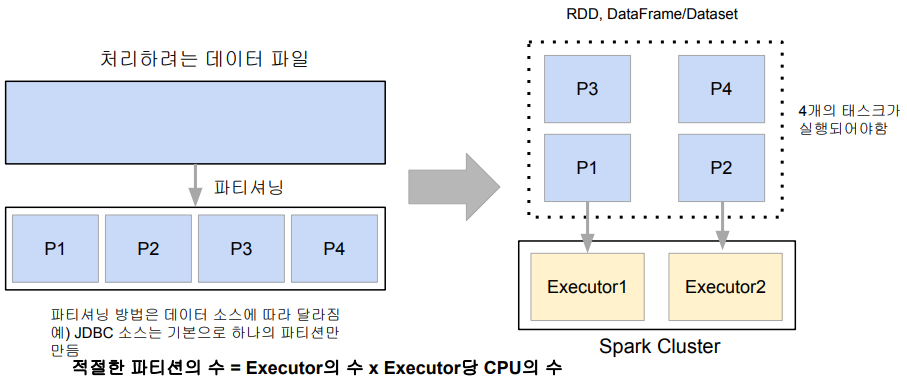
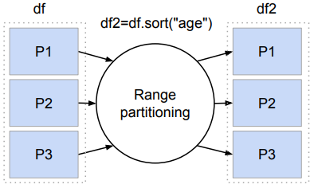
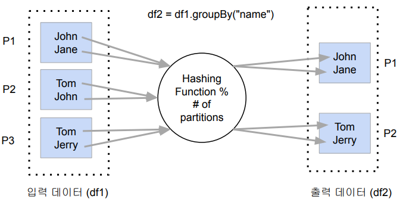
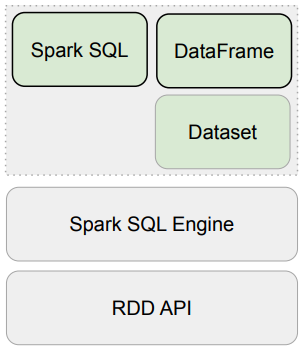

## <u>2주차 intro</u>

### Spark 프로그래밍: DataFrame

Contents

1. Spark 데이터 처리
2. Spark 데이터 구조: RDD, DataFrame, Dataset
3. 프로그램 구조
4. 개발/실습 환경 소개
5. Spark DataFrame 실습

<br>
<br>
<br>

## <u>2주차 Summary</u>

### 요약

- 데이터 처리에서 중요한 개념: Partition, Shuffling
- 데이터 구조: RDD, DataFrame, Dataset
- Spark Session 생성과 설정
- DataFrame 프로그래밍

<br>
<br>
<br>

## <u>1. Spark 데이터 처리</u>

### Spark 데이터 처리

Spark 데이터 시스템 아키텍처


<br>

데이터 병렬처리가 가능하려면?

- 데이터가 먼저 분산되어야함
  - 하둡 맵의 데이터 처리 단위는 디스크에 있는 데이터 블록 (128MB)
    - hdfs-site.xml에 있는 dfs.block.size 프로퍼티가 결정
  - Spark에서는 이를 파티션 (Partition)이라 부름. 파티션의 기본크기도 128MB
    - spark.sql.files.maxPartitionBytes: HDFS등에 있는 파일을 읽어올 때만 적용됨
- 다음으로 나눠진 데이터를 각각 따로 동시 처리
  - 맵리듀스에서 N개의 데이터 블록으로 구성된 파일 처리시 N개의 Map 태스크가 실행
  - Spark에서는 파티션 단위로 메모리로 로드되어 Executor가 배정됨

<br>

처리 데이터를 나누기 -> 파티션 -> 병렬처리



<br>

Spark 데이터 처리 흐름

- 데이터프레임은 작은 파티션들로 구성됨
  - 데이터프레임은 한번 만들어지면 수정 불가 (Immutable)
- 입력 데이터프레임을 원하는 결과 도출까지 다른 데이터 프레임으로 계속 변환
  - sort, group by, filter, map, join, …

<br>

셔플링: 파티션간에 데이터 이동이 필요한 경우 발생

- 셔플링이 발생하는 경우는?
  - 명시적 파티션을 새롭게 하는 경우 (예: 파티션 수를 줄이기)
  - 시스템에 의해 이뤄지는 셔플링
    - 예를 들면 그룹핑 등의 aggregation이나 sorting
- 셔플링이 발생할 때 네트웍을 타고 데이터가 이동하게 됨

  - 몇 개의 파티션이 결과로 만들어질까?
    - spark.sql.shuffle.partitions이 결정
      - 기본값은 200이며 이는 최대 파티션 수
    - 오퍼레이션에 따라 파티션 수가 결정됨
      - random, hashing partition, range partition 등등
      - sorting의 경우 range partition을 사용함
  - 또한 이때 Data Skew 발생 가능!

    

<br>

셔플링: hashing partition

- Aggregation 오퍼레이션

  

<br>

Data Skewness

- Data partitioning은 데이터 처리에 병렬성을 주지만 단점도 존재
  - 이는 데이터가 균등하게 분포하지 않는 경우
    - 주로 데이터 셔플링 후에 발생
  - 셔플링을 최소화하는 것이 중요하고 **파티션 최적화**를 하는 것이 중요.

<br>
<br>
<br>

## <u>2. Spark 데이터 구조</u>

### Spark 데이터 구조: RDD, DataFrame, Dataset

Spark 데이터 구조

- RDD, DataFrame, Dataset (Immutable Distributed Data)
  - 2016년에 DataFrame과 Dataset은 하나의 API로 통합됨
  - 모두 파티션으로 나뉘어 Spark에서 처리됨

|                      | RDD                                                           | DataFrame                       | Dataset                 |
| -------------------- | ------------------------------------------------------------- | ------------------------------- | ----------------------- |
| 무엇인지?            | Distributed collection of records (structured & unstructured) | RDD organized into named column | Extension of data frame |
| 언제 소개?           | 1.0                                                           | 1.3                             | 1.6                     |
| 컴파일타임 타입 체크 | No                                                            | No                              | Yes                     |
| 사용하기 쉬운 API    | No                                                            | Yes                             | Yes                     |
| SparkSQL 기반        | No                                                            | Yes                             | Yes                     |
| Catalyst Optimizer   | No                                                            | Yes                             | Yes                     |

<br>

Spark 데이터 구조

- RDD (Resilient Distributed Dataset)
  - 로우레벨 데이터로 클러스터내의 서버에 분산된 데이터를 지칭
  - 레코드별로 존재하지만 스키마가 존재하지 않음
    - 구조화된 데이터나 비구조화된 데이터 모두 지원
- DataFrame과 Dataset

  - RDD위에 만들어지는 RDD와는 달리 필드 정보를 갖고 있음 (테이블)
  - Dataset은 타입 정보가 존재하며 컴파일 언어에서 사용가능
    - 컴파일 언어: Scala/Java에서 사용가능
  - PySpark에서는 DataFrame을 사용

    

1. Code Analysis
2. Logical Optimization (Catalyst Optimizer)
3. Physical Planning
4. Code Generation (ProjectTungsten)

<br>

Spark 데이터 구조 - RDD

- 변경이 불가능한 분산 저장된 데이터
  - RDD는 다수의 파티션으로 구성
  - 로우레벨의 함수형 변환 지원 (map, filter, flatMap 등등)
- 일반 파이썬 데이터는 parallelize 함수로 RDD로 변환
  - 반대는 collect로 파이썬 데이터로 변환가능

```python
py_list = [
 (1, 2, 3, 'a b c'),
 (4, 5, 6, 'd e f'),
 (7, 8, 9, 'g h i')
]
rdd = sc.parallelize(py_list)
…
print(rdd.collect())
```


<br>

Spark 데이터 구조 - 데이터 프레임

- 변경이 불가한 분산 저장된 데이터
- RDD와는 다르게 관계형 데이터베이스 테이블처럼 컬럼으로 나눠 저장
  - 판다스의 데이터 프레임 혹은 관계형 데이터베이스의 테이블과 거의 흡사
  - 다양한 데이터소스 지원: HDFS, Hive, 외부 데이터베이스, RDD 등등
- 스칼라, 자바, 파이썬과 같은 언어에서 지원

<br>
<br>
<br>

## <u>3. Spark 프로그램 구조</u>

### 프로그램 구조

<br>
<br>
<br>

<br>
<br>
<br>
<br>
<br>
<br>

- **Keyword**:

<br>
<br>
<br>
<br>
<br>
<br>
